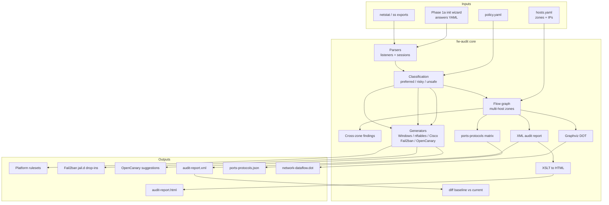
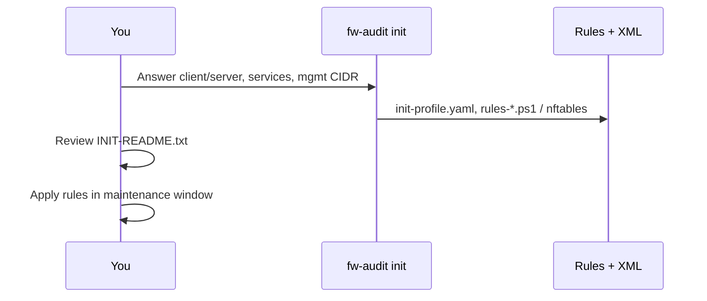
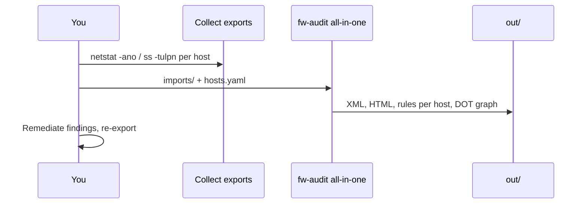
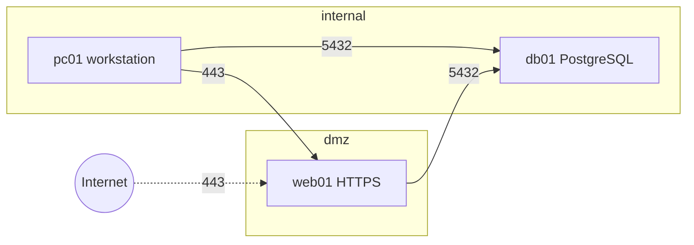

# Firewall Ruleset & Network Exposure Audit Tool (`fw-audit`)

Python CLI for **personal / home lab** use: ingest netstat or open-port exports (or answer a short questionnaire), classify exposure using cybersecurity best practices, generate **deny-by-default** firewall rules for Windows, Linux, and Cisco, and produce **XML audit reports** with an **XSLT** HTML view for assessments.

Aligned with **CIS Controls v8.1 (IG1)** and **NIST SP 800-53 Rev 5** (SC-7, AC-4) concepts — see [docs/PLAN.md](docs/PLAN.md) and [docs/compliance-mapping.md](docs/compliance-mapping.md).

## Architecture



## Recommended composition

For home-lab / SnarkSentinel use, treat `fw-audit` as the host-firewall planner inside a small defense-in-depth stack—not as a complete security product on its own:

| Layer | Role |
|-------|------|
| **Host firewall** | Apply deny-by-default **nftables** or **Windows Firewall** rules generated by `fw-audit` from observed listeners / init answers |
| **Fail2ban** | Jail brute-force and abuse on ports you intentionally leave open (SSH, etc.) |
| **OpenCanary** | Decoy services on unused / unexpected ports to catch scanners and lateral movement |
| **Quad9 DNS** | Use `9.9.9.9` (or Quad9 DoH/DoT) as filtered, privacy-respecting recursive DNS to block many malicious domains |
| **Optional IP blocklists** | Feed known-bad networks into the firewall or upstream filter when you need extra deny lists |

**SnarkSentinel** consumes the audit artifacts (XML findings, `ports-protocols.json`, rulesets, OpenCanary suggestions, and the multi-host flow graph) via the [library API](docs/INTEGRATION.md); it does not replace Fail2ban, OpenCanary, or DNS filtering.

## Workflows

### A — New host baseline (no netstat yet)



```bash
fw-audit init -o out-init/                    # interactive
fw-audit init --answers my-answers.yaml -o out-init/
```

Example output: [docs/examples/client-simple-output.md](docs/examples/client-simple-output.md)

### B — Audit existing hosts (netstat / ss)



```bash
pip install -e ".[dev]"

# Per machine
netstat -ano > imports/pc01/netstat.txt
ss -tulpn > imports/web01/ss.txt

fw-audit all-in-one imports/ \
  --hosts examples/dmz-lab/hosts.yaml \
  -o out/ --platform all
```

Example output: [docs/examples/dmz-lab-output.md](docs/examples/dmz-lab-output.md)

### C — DMZ three-tier (client + server + database)



Inventory: [examples/dmz-lab/hosts.yaml](examples/dmz-lab/hosts.yaml) — `allowed_zone_pairs` control which cross-zone **sessions** are permitted.

## Commands

| Command | Description |
|---------|-------------|
| `fw-audit init` | Phase 1a — secure baseline from questionnaire |
| `fw-audit ingest <path>` | Validate inputs (listeners + sessions) |
| `fw-audit analyze <path>` | Classify + findings (+ cross-zone) |
| `fw-audit report <path> -o out/` | XML + `ports-protocols.json` (YAML/CSV sidecars) |
| `fw-audit generate <path> -o out/` | Rulesets (`--platform windows\|nftables\|cisco\|fail2ban\|all`) |
| `fw-audit all-in-one <path> -o out/` | Rules + XML + ports/protocols matrix + DOT (`--dot` / `--no-dot`) |
| `fw-audit html audit-report.xml` | XSLT → HTML (requires `xsltproc`) |
| `fw-audit diff <baseline.xml> <current.xml>` | Drift vs baseline (`--format text\|json`) |

## Fail2ban composition

fw-audit classifies listeners and drafts **deny-by-default** host firewall rules; it does **not** re-implement reactive banning. For every **preferred** / **risky** listener that policy still allows, `generate` / `all-in-one` (with `--platform nftables` or `all`) also emit a Fail2ban jail.d drop-in:

```text
out/<hostname>/jail.d/fw-audit.conf
```

- Uses the **nftables** ban actions (`nftables-multiport` / `nftables-allports`).
- Jails with a stock filter (e.g. `sshd`, `nginx-http-auth`) are `enabled = true`; others are left disabled until you add a matching `filter.d` file.
- Review, then copy to `/etc/fail2ban/jail.d/` on the host — same “review before apply” model as the firewall rulesets.

## Development and testing

Use a virtual environment so `pip` is available on minimal Linux hosts (Arch, containers, CI):

```bash
python3 -m venv .venv
source .venv/bin/activate   # Windows: .venv\Scripts\activate
python -m pip install --upgrade pip
pip install -e ".[dev]"
pytest
```

CI runs the same steps via [`.github/workflows/ci.yml`](.github/workflows/ci.yml).

Behavior scenarios (Gherkin, documentation-only — no Cucumber runner) live under [`features/`](features/):

| Feature | Happy paths |
|---------|-------------|
| [`init.feature`](features/init.feature) | `fw-audit init` baseline from answers YAML |
| [`all-in-one.feature`](features/all-in-one.feature) | `all-in-one` / `report` / `generate` on fixtures + DMZ examples |
| [`diff.feature`](features/diff.feature) | `fw-audit diff` drift vs baseline XML |
| [`library-api.feature`](features/library-api.feature) | `analyze` / `diff` / `generate_local_only` contract |

## Status by phase

| Phase | Features |
|-------|----------|
| **1** | Parsers, classification, XML/XSLT, Windows + nftables |
| **1a** | `init` wizard — client/server/services, mgmt CIDR restrictions |
| **2** | Multi-host batch, TCP sessions, cross-zone findings, Cisco IOS ACL, Graphviz DOT |
| **2b** | Fail2ban jail.d + OpenCanary suggestions; `ports-protocols.json` matrix |
| **3** | AWS / Azure / GCP (planned) |
| **4** | `diff` (XML/matrix drift) + library API; nmap XML, policy lint (planned) |

## Port categories (report colors)

| Category | Meaning |
|----------|---------|
| **preferred** | SSH, HTTPS — allow when policy permits |
| **risky** | HTTP, RDP, SMB — restrict source or block |
| **unsafe** | Telnet, open Docker API — deny + critical finding |

## Library API (SnarkSentinel / embedders)

Programmatic analyze, baseline diff, and local-only ruleset drafting — without
scraping CLI output:

```python
from fw_audit import analyze, diff, generate_local_only
```

Contract and examples: [docs/INTEGRATION.md](docs/INTEGRATION.md).

## Documentation

- [openspec/spec.md](openspec/spec.md) — current capabilities and architecture (OpenSpec)
- [features/](features/) — Gherkin scenarios for core CLI and library happy paths
- [docs/INTEGRATION.md](docs/INTEGRATION.md) — library API for SnarkSentinel
- [docs/PLAN.md](docs/PLAN.md) — full roadmap
- [docs/GAP-ANALYSIS.md](docs/GAP-ANALYSIS.md) — comparison vs GATEKEEP, fwbuilder, net-guardian, etc.
- [docs/schema/network-audit.xsd](docs/schema/network-audit.xsd) — audit XML schema
- [docs/examples/](docs/examples/) — sample client and DMZ outputs

## Tests

```bash
pytest -q
```

## License

Apache License 2.0 — see [LICENSE](LICENSE).

## Outbound whitelisting and network posture

**Today:** fw-audit can **audit** and **generate Linux egress rules** from an outbound port whitelist; it annotates each client’s **gateway**, **DNS servers**, **NICs** (Wi‑Fi / Bluetooth / virtual), and **internet-bound processes** in the XML report.

| Capability | Status |
|------------|--------|
| Default-deny **outbound** (Linux clients) | `outbound_whitelist.enforce: true` in policy |
| Trusted gateway / DNS checks | `trusted_gateways`, `trusted_dns` |
| Wi‑Fi / Bluetooth routing risk | Findings when interfaces are up against policy |
| Per-process internet usage | From `ss` exports → `OutboundClientServices` in XML |
| Windows per-app block | **Not fully** — use WDAC/AppLocker; we generate port rules only |

See [docs/OUTBOUND-WHITELIST.md](docs/OUTBOUND-WHITELIST.md) and [examples/home-lab/policy-outbound-whitelist.yaml](examples/home-lab/policy-outbound-whitelist.yaml).

Collect profile data with [scripts/collect-linux.sh](scripts/collect-linux.sh) or `ipconfig /all` (Windows).

