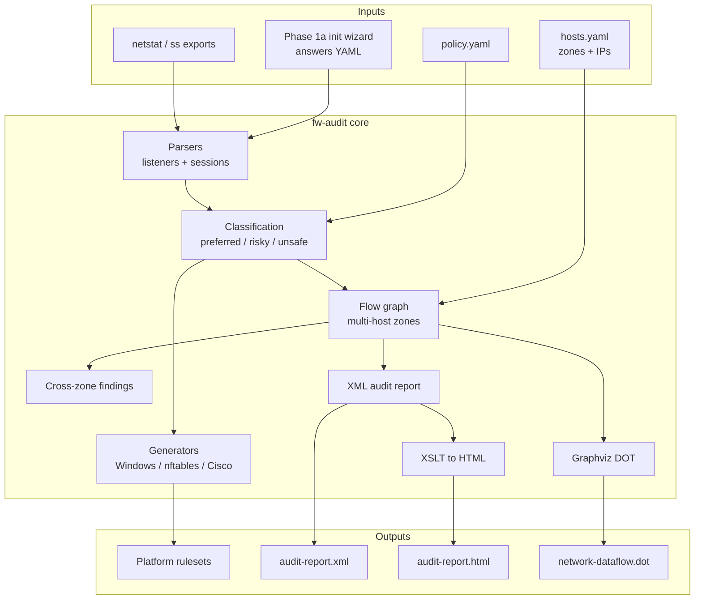
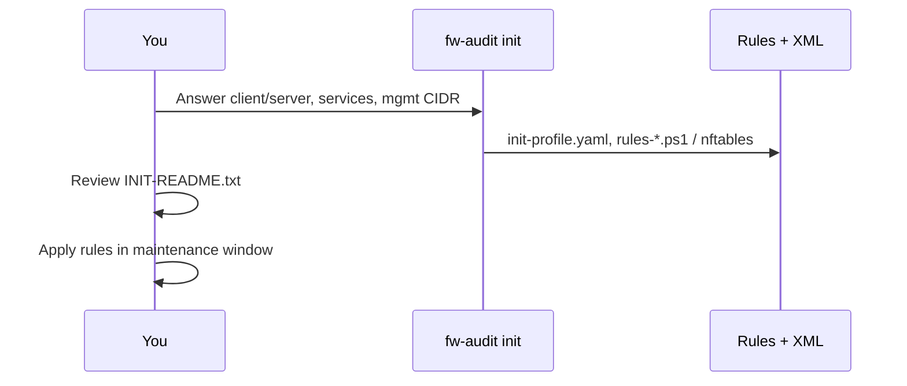
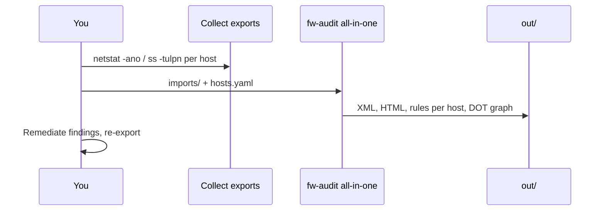
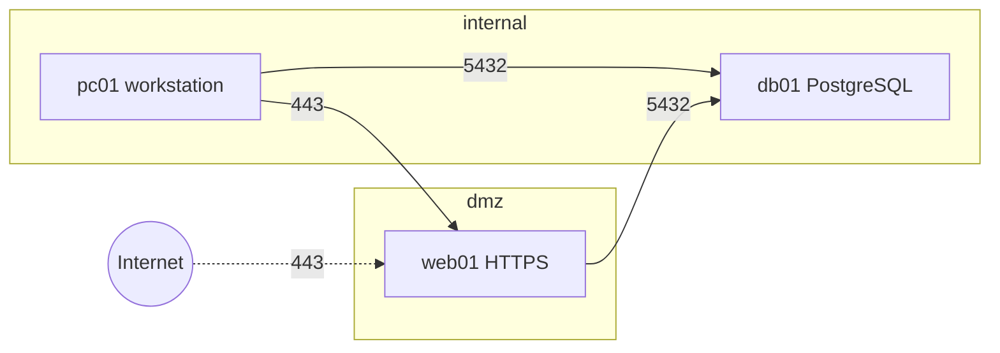

# Firewall Ruleset & Network Exposure Audit Tool (`fw-audit`)

Python CLI for **personal / home lab** use: ingest netstat or open-port exports (or answer a short questionnaire), classify exposure using cybersecurity best practices, generate **deny-by-default** firewall rules for Windows, Linux, and Cisco, and produce **XML audit reports** with an **XSLT** HTML view for assessments.

Aligned with **CIS Controls v8.1 (IG1)** and **NIST SP 800-53 Rev 5** (SC-7, AC-4) concepts — see [docs/PLAN.md](docs/PLAN.md) and [docs/compliance-mapping.md](docs/compliance-mapping.md).

## Architecture



## Workflows

### A — New host baseline (no netstat yet)



```bash
fw-audit init -o out-init/                    # interactive
fw-audit init --answers my-answers.yaml -o out-init/
```

Example output: [docs/examples/client-simple-output.md](docs/examples/client-simple-output.md)

### B — Audit existing hosts (netstat / ss)



```bash
pip install -e ".[dev]"

# Per machine
netstat -ano > imports/pc01/netstat.txt
ss -tulpn > imports/web01/ss.txt

fw-audit all-in-one imports/ \
  --hosts examples/dmz-lab/hosts.yaml \
  -o out/ --platform all
```

Example output: [docs/examples/dmz-lab-output.md](docs/examples/dmz-lab-output.md)

### C — DMZ three-tier (client + server + database)



Inventory: [examples/dmz-lab/hosts.yaml](examples/dmz-lab/hosts.yaml) — `allowed_zone_pairs` control which cross-zone **sessions** are permitted.

## Commands

| Command | Description |
|---------|-------------|
| `fw-audit init` | Phase 1a — secure baseline from questionnaire |
| `fw-audit ingest <path>` | Validate inputs (listeners + sessions) |
| `fw-audit analyze <path>` | Classify + findings (+ cross-zone) |
| `fw-audit report <path> -o out/` | XML only |
| `fw-audit generate <path> -o out/` | Rulesets (`--platform windows\|nftables\|cisco\|all`) |
| `fw-audit all-in-one <path> -o out/` | Rules + XML + DOT (`--dot` / `--no-dot`) |
| `fw-audit html audit-report.xml` | XSLT → HTML (requires `xsltproc`) |
| `fw-audit diff <baseline.xml> <current.xml>` | Drift vs baseline (`--format text\|json`) |

## Development and testing

Use a virtual environment so `pip` is available on minimal Linux hosts (Arch, containers, CI):

```bash
python3 -m venv .venv
source .venv/bin/activate   # Windows: .venv\Scripts\activate
python -m pip install --upgrade pip
pip install -e ".[dev]"
pytest
```

CI runs the same steps via [`.github/workflows/ci.yml`](.github/workflows/ci.yml).

## Status by phase

| Phase | Features |
|-------|----------|
| **1** | Parsers, classification, XML/XSLT, Windows + nftables |
| **1a** | `init` wizard — client/server/services, mgmt CIDR restrictions |
| **2** | Multi-host batch, TCP sessions, cross-zone findings, Cisco IOS ACL, Graphviz DOT |
| **3** | AWS / Azure / GCP (planned) |
| **4** | `diff` (XML drift); nmap XML, policy lint (planned) |

## Port categories (report colors)

| Category | Meaning |
|----------|---------|
| **preferred** | SSH, HTTPS — allow when policy permits |
| **risky** | HTTP, RDP, SMB — restrict source or block |
| **unsafe** | Telnet, open Docker API — deny + critical finding |

## Documentation

- [docs/PLAN.md](docs/PLAN.md) — full roadmap
- [docs/GAP-ANALYSIS.md](docs/GAP-ANALYSIS.md) — comparison vs GATEKEEP, fwbuilder, net-guardian, etc.
- [docs/schema/network-audit.xsd](docs/schema/network-audit.xsd) — audit XML schema
- [docs/examples/](docs/examples/) — sample client and DMZ outputs

## Tests

```bash
pytest -q
```

## License

Apache License 2.0 — see [LICENSE](LICENSE).
