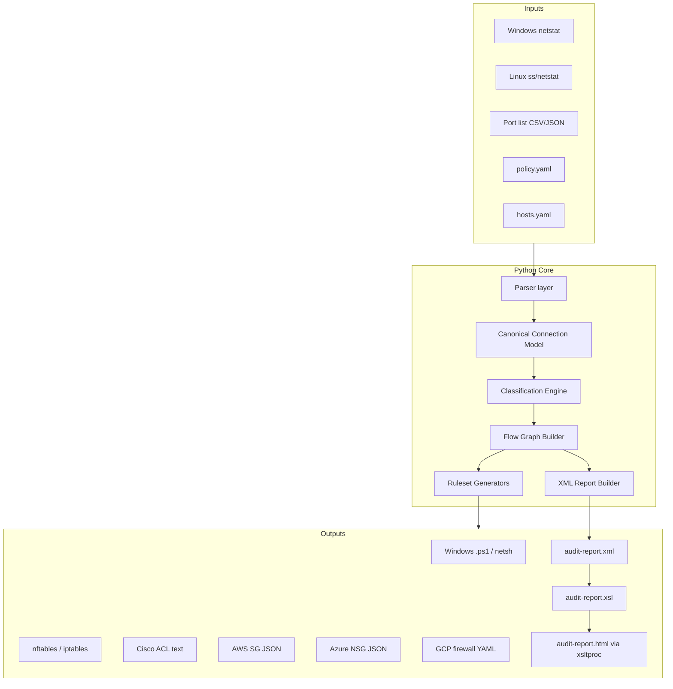

# Firewall Ruleset & Network Exposure Audit Tool — Implementation Plan

**Purpose:** A Python, text-based CLI for personal/home lab use that ingests netstat exports or open-port inventories, normalizes them into a canonical connection model, classifies exposure using cybersecurity best practices, emits platform-specific firewall rulesets (Windows, Linux, Cisco, cloud), and produces an **XML audit report** with an **XSLT stylesheet** for human-readable, color-coded review during security assessments.

**License:** Apache 2.0 (existing repo LICENSE)

---

## 1. Goals and Non-Goals

### Goals

| Goal | Description |
|------|-------------|
| **Ingest** | Parse netstat/listening-port exports from Windows, Linux, and generic CSV/JSON port lists |
| **Normalize** | Build a graph of *who talks to whom* (client/server, protocol, port, direction, zone) |
| **Classify** | Tag each port/protocol as **preferred**, **risky**, or **unsafe** using curated defaults + overrides |
| **Generate rules** | Output deny-by-default firewall snippets for Windows Firewall, `nftables`/`iptables`, Cisco ACL-style, AWS Security Groups, Azure NSG, GCP firewall rules |
| **Audit artifact** | Produce standards-aligned XML describing flows, findings, and control mappings |
| **Visual review** | Ship XSLT 1.0 CSS/HTML view with color categories for auditors and home operators |

### Non-Goals (v1)

- Live agent deployment or remote scanning (offline/batch only)
- Automatic push to cloud APIs (generate files; human applies)
- Full CMDB/asset discovery (manual hostnames/zones in config)
- Replacing enterprise GRC tools (feeds audit evidence, not SOAR)

---

## 2. Compliance Alignment Framework

The tool embeds **traceability metadata** in every XML report and rule file header so auditors can map outputs to control families without re-interpreting raw netstat.

### 2.1 SANS / CIS Critical Security Controls v8.1 (Implementation Group 1 — Essential Cyber Hygiene)

| CIS Safeguard | How the tool supports it |
|---------------|--------------------------|
| **4.4** Implement firewall on servers | Generates server-specific host firewall configs from observed listeners |
| **4.5** Implement firewall on end-user devices | Windows/Linux host profiles from endpoint exports |
| **9.2** Ensure only approved ports enabled | Diff: observed vs policy; flag unauthorized listeners |
| **9.3** Perform regular automated port scans | Accepts scan output (nmap XML optional future); documents cadence in report |
| **9.4** Host-based firewalls / port-filtering, default-deny | All generators use **deny-by-default, allow-by-exception** templates |
| **12.4** Deny communication over unauthorized ports | Classification engine marks non-approved ports; ruleset blocks them |
| **13.3** Monitor/block unauthorized network traffic | Report section: unauthorized flows and recommended blocks |
| **Asset inventory (CIS 1.x)** | Host records in XML: hostname, role, zone, owner (user-supplied YAML) |

**Measurement hooks (for home self-assessment):**

- Ratio of hosts with default-deny templates applied vs total hosts
- Count of **unsafe** / **risky** listeners still bound after proposed rules
- Count of flows crossing zone boundaries without explicit allow rules

### 2.2 FedRAMP / NIST SP 800-53 Rev 5 (conceptual alignment for audit narratives)

| Control | Relevance to tool outputs |
|---------|---------------------------|
| **SC-7** Boundary Protection | XML documents external vs internal interfaces, DMZ/public tier tags, managed interface names |
| **SC-7(5)** Deny by default — allow by exception | Core rule generation philosophy; stated in every ruleset header |
| **SC-7(12)** Host-based protection | Linux/Windows host rule modules |
| **SC-7(21)** Isolation of system components | Zone model (public / dmz / internal / mgmt) drives east-west recommendations |
| **AC-4** Information flow enforcement | Flow matrix in XML: source zone → dest zone → port/proto |
| **CM-6** Configuration settings | Baseline port policy YAML versioned and hashed in report |
| **SI-4** System monitoring | Optional: ingest frequency metadata; recommend port-scan schedule |
| **AU-2 / AU-12** Audit events | Report `generatedAt`, `toolVersion`, input file checksums (integrity) |

**FedRAMP documentation artifacts the XML should enable:**

- Network/dataflow diagram inputs (host + edge list exportable to Graphviz DOT)
- Ruleset version and approval workflow fields (`approvedBy`, `effectiveDate`)
- Separation of publicly accessible components (tag `exposure="public"`)

> **Note:** FedRAMP authorization still requires human SSP narrative; this tool produces **evidence** and **draft rules**, not an ATO.

### 2.3 Additional references

- **NIST SP 800-41** Firewall guidelines (rule ordering, management interfaces)
- **NIST SP 800-207** Zero Trust — identity/zone tags on flows (future)
- **CISA KEV / MSRC** — optional feed hook to bump classification for exploited ports

---

## 3. Architecture Overview



### 3.1 Design principles

1. **Single canonical model** — all parsers emit the same dataclasses
2. **Policy as code** — defaults in repo; home overrides in `~/.config/fw-audit/policy.yaml`
3. **Immutable audit trail** — SHA-256 of inputs embedded in XML
4. **Safe defaults** — classification errs toward **risky** when unknown
5. **No network I/O in core path** — optional update checks behind explicit flag

---

## 4. Repository Layout (proposed)

```
fw-audit/                          # PyPI name TBD
├── pyproject.toml                 # hatchling, ruff, pytest
├── README.md
├── docs/
│   ├── PLAN.md                    # this document
│   ├── compliance-mapping.md    # CIS/FedRAMP field dictionary
│   └── schema/                    # XSD for audit XML
│       └── network-audit.xsd
├── src/fw_audit/
│   ├── __init__.py
│   ├── cli.py                     # Click or Typer entry: fw-audit
│   ├── models.py                  # Host, Listener, Flow, Rule, Finding
│   ├── parsers/
│   │   ├── netstat_windows.py
│   │   ├── netstat_linux.py
│   │   ├── ss_linux.py
│   │   └── port_list.py
│   ├── classify/
│   │   ├── defaults.yaml          # built-in port categories
│   │   └── engine.py
│   ├── graph/
│   │   └── flows.py
│   ├── generators/
│   │   ├── base.py
│   │   ├── windows.py
│   │   ├── linux_nftables.py
│   │   ├── linux_iptables.py
│   │   ├── cisco_ios.py
│   │   ├── aws_sg.py
│   │   ├── azure_nsg.py
│   │   └── gcp_firewall.py
│   ├── report/
│   │   ├── xml_builder.py
│   │   └── templates/
│   │       └── audit-report.xsl
│   └── policy/
│       └── loader.py
├── tests/
│   ├── fixtures/                  # sample netstat files
│   └── ...
└── examples/
    └── home-lab/
        ├── hosts.yaml
        ├── policy.yaml
        └── sample-netstat.txt
```

---

## 5. Canonical Data Model

### 5.1 Entities

```text
Host
  id, hostname, fqdn, role (server|workstation|router|cloud)
  zone (internal|dmz|public|mgmt)
  os_family, owner, tags[]

Listener
  host_id, protocol (tcp|udp), port, bind_address
  process_name?, state (listening|established)
  observed_in_file, line_number

Flow (derived)
  client_host_id?, client_ip, server_host_id, server_ip
  protocol, port, direction (inbound|outbound)
  classification (preferred|risky|unsafe|unknown)
  cis_safeguards[], nist_controls[]

Finding
  severity (info|low|medium|high|critical)
  code (e.g. UNSAFE_PORT_LISTENING, CROSS_ZONE_SSH)
  message, remediation, related_flow_ids[]

RulesetArtifact
  platform, format, path, default_deny (bool), rule_count
```

### 5.2 Zone and exposure model

Users define zones in `hosts.yaml`. If omitted, infer:

- `0.0.0.0` / `::` bind → elevated exposure
- Public IP listeners → tag `exposure=public`
- RFC1918-only → `internal`

Cross-zone flows without matching allow policy → **Finding** severity ≥ medium.

---

## 6. Input Formats

### 6.1 Windows netstat

```cmd
netstat -ano > netstat-windows.txt
```

Parser handles: `TCP`, `UDP`, `LISTENING`, `ESTABLISHED`, foreign/local address:port, PID.

### 6.2 Linux

```bash
ss -tulpn > ss-linux.txt
# or
netstat -tulpn > netstat-linux.txt
```

### 6.3 Generic port list (CSV)

```csv
hostname,zone,protocol,port,direction,process,notes
nas.internal,tcp,445,inbound,smbd,observed
```

### 6.4 Multi-host batch

Directory layout:

```text
imports/
  web01/netstat.txt
  db01/ss.txt
  hosts.yaml          # maps folder → host metadata
```

---

## 7. Port Classification Engine

### 7.1 Categories (for XSLT color coding)

| Category | Color (XSLT) | Meaning | Examples |
|----------|--------------|---------|----------|
| **preferred** | Green `#2e7d32` | Expected admin/user services; TLS where applicable | 22/tcp (SSH), 443/tcp (HTTPS), 53/udp (DNS internal) |
| **risky** | Amber `#f9a825` | Legitimate but commonly abused; restrict by source | 80/tcp, 3389/tcp (RDP), 5900/tcp (VNC), 445/tcp (SMB) |
| **unsafe** | Red `#c62828` | Should not be exposed; deny by default | 23/tcp (Telnet), 21/tcp (FTP cleartext), 135/139/445 from internet, 2375/tcp (Docker API), /redis 6379 public |
| **unknown** | Gray `#757575` | Not in policy — treat as risky until reviewed |

### 7.2 Built-in policy structure (`defaults.yaml`)

```yaml
version: "1.0"
default_unknown: risky
categories:
  preferred:
    - { proto: tcp, port: 22, service: ssh, notes: "Mgmt only from jump host" }
    - { proto: tcp, port: 443, service: https }
  risky:
    - { proto: tcp, port: 80, service: http }
    - { proto: tcp, port: 3389, service: rdp }
  unsafe:
    - { proto: tcp, port: 23, service: telnet }
    - { proto: tcp, port: 2375, service: docker-api }
rules:
  - id: SMB_FROM_INTERNET
    match: { proto: tcp, port: 445 }
    condition: source_zone == public
    classification: unsafe
  - id: SSH_FROM_ANY
    match: { proto: tcp, port: 22 }
    condition: source_zone != mgmt
    classification: risky
```

### 7.3 CIS-aligned behavior

- **Default deny** in generators; only **preferred** + user **approved** risky ports become allow rules
- **Unsafe** → explicit deny + critical Finding
- **Risky** → allow only if `policy.yaml` lists `approved_sources` CIDRs

---

## 8. Firewall Ruleset Generators

All generators share:

1. Header comment: tool version, timestamp, CIS 9.4 / SC-7(5) reference
2. **Default deny** baseline
3. Explicit allows sorted: mgmt → internal → dmz → public
4. Logging/drop counters where platform supports it

### 8.1 Windows

- Output: `rules-windows.ps1` using `New-NetFirewallRule` + optional `netsh advfirewall`
- Group by profile: Domain / Private / Public
- Map risky RDP/SMB to **block on Public profile**

### 8.2 Linux

- Primary: **nftables** set-based rules (`rules-nftables.conf`)
- Fallback: **iptables-save** format for older hosts
- Separate `INPUT` / `FORWARD` if `hosts.yaml` marks `role: router`

### 8.3 Cisco

- IOS/IOS-XE style extended ACL + object-groups
- ASA-style if `-t asa` flag
- Comments for line placement (inside/outside interface)

### 8.4 Cloud (artifact-only)

| Platform | Output | Notes |
|----------|--------|-------|
| AWS | `sg-rules.json` | Ingress/egress per Security Group ID from config |
| Azure | `nsg-rules.json` | Priority integers, direction |
| GCP | `firewall-rules.yaml` | Network tags on instances |

Cloud rules use **least-privilege CIDR** from flow graph; never `0.0.0.0/0` unless port is **preferred** and user confirms in CLI `--i-understand-public-exposure`.

---

## 9. XML Audit Report

### 9.1 Design requirements

- Valid against published **XSD** in `docs/schema/network-audit.xsd`
- Namespace: `urn:fw-audit:network-audit:1`
- UTF-8, indented, XSD `ID` attributes for cross-references
- Embeds: metadata, inventory, observations, flows, findings, ruleset index, compliance block

### 9.2 Root element sketch

```xml
<NetworkAuditReport xmlns="urn:fw-audit:network-audit:1"
  version="1.0"
  generatedAt="2026-05-25T12:00:00Z"
  toolVersion="0.1.0">
  <Metadata>
    <InputChecksum algorithm="sha256" file="netstat-windows.txt">...</InputChecksum>
    <PolicyVersion>1.0</PolicyVersion>
    <Operator>home-lab</Operator>
  </Metadata>
  <ComplianceMapping>
    <Framework name="CIS Controls" version="8.1">
      <Safeguard id="9.4" status="addressed">...</Safeguard>
    </Framework>
    <Framework name="NIST 800-53" version="rev5">
      <Control id="SC-7(5)" status="addressed">...</Control>
    </Framework>
  </ComplianceMapping>
  <Inventory>...</Inventory>
  <ObservedListeners>...</ObservedListeners>
  <Flows>
    <Flow id="F001" classification="risky">
      <Client hostRef="H002" zone="internal" address="192.168.1.50"/>
      <Server hostRef="H001" zone="dmz" address="10.0.0.5"/>
      <Service protocol="tcp" port="443" name="https"/>
    </Flow>
  </Flows>
  <Findings>...</Findings>
  <RulesetArtifacts>...</RulesetArtifacts>
</NetworkAuditReport>
```

### 9.3 Auditor-facing sections

1. **Executive summary** — counts by classification
2. **Flow matrix** — source zone × dest zone × port
3. **Deviations from policy** — unauthorized listeners
4. **Recommended remediation** — ordered by severity
5. **Evidence appendix** — input hashes, parser warnings

---

## 10. XSLT Stylesheet (`audit-report.xsl`)

### 10.1 Requirements

- XSLT **1.0** for broad compatibility (`xsltproc`, browser transform optional)
- Output: HTML5 + embedded CSS
- Color via `classification` attribute:

```xml
<xsl:template match="Flow[@classification='unsafe']">
  <tr class="unsafe">...</tr>
</xsl:template>
```

```css
tr.preferred td { background: #e8f5e9; border-left: 4px solid #2e7d32; }
tr.risky td     { background: #fff8e1; border-left: 4px solid #f9a825; }
tr.unsafe td    { background: #ffebee; border-left: 4px solid #c62828; }
tr.unknown td   { background: #f5f5f5; border-left: 4px solid #757575; }
```

### 10.2 UI sections

- Summary cards (preferred / risky / unsafe / unknown counts)
- Sortable flow table (optional lightweight JS behind `--with-js` build flag; default pure XSLT)
- Findings panel with severity icons
- Compliance mapping table (CIS + NIST columns)
- Link to generated ruleset files (relative paths)

### 10.3 CLI integration

```bash
fw-audit report --input imports/ --output out/audit-report.xml
xsltproc -o out/audit-report.html src/fw_audit/report/templates/audit-report.xsl out/audit-report.xml
# or
fw-audit html --xml out/audit-report.xml   # wraps xsltproc detection
```

---

## 11. CLI Specification

```bash
fw-audit ingest <path>              # validate & summarize inputs
fw-audit analyze <path>             # classify + findings to stdout
fw-audit generate rules <path>      # all platforms or --platform windows
fw-audit report <path>              # XML only
fw-audit all-in-one <path>          # rules + xml + html (home default)
```

**Global flags:** `--policy`, `--hosts`, `--output-dir`, `--dry-run`, `--verbose`, `--format json` (machine-readable summary for automation).

**Config precedence:** CLI > `./policy.yaml` > `~/.config/fw-audit/policy.yaml` > packaged `defaults.yaml`.

---

## 12. Implementation Phases

### Phase 1 — Foundation (MVP)

- [ ] Project scaffold (`pyproject.toml`, Typer CLI, ruff, pytest)
- [ ] Models + Windows/Linux parsers
- [ ] Classification engine + packaged `defaults.yaml`
- [ ] XML builder + XSD v1
- [ ] XSLT with color categories
- [ ] Linux nftables + Windows PowerShell generators

**Exit criteria:** Single host netstat → XML + HTML + one ruleset; tests cover parsers and classification.

### Phase 2 — Multi-host & graph

- [x] `hosts.yaml` inventory + batch imports
- [x] Flow graph (ESTABLISHED connections)
- [x] Cross-zone findings
- [x] Cisco IOS ACL generator

### Phase 3 — Cloud & policy hardening

- [ ] AWS / Azure / GCP artifact generators
- [ ] Approved source CIDRs for risky ports
- [x] Graphviz DOT export for dataflow diagrams (Phase 2)
- [ ] `compliance-mapping.md` auto-section in XML

### Phase 4 — Operational polish (home lab)

- [x] `fw-audit diff` — compare two audit XML snapshots (unsafe/risky listeners, classification changes, cross-zone flows; text + JSON)
- [ ] Optional nmap XML import
- [ ] Policy lint (`fw-audit policy validate`)
- [ ] Pre-commit hook example for exported reports

---

## 13. Security & Privacy Considerations (Home Use)

| Topic | Approach |
|-------|----------|
| Sensitive data in netstat | Reports may contain internal IPs; `--redact` masks last octet in XML |
| Running generated scripts | Print **"review before apply"** banner; no auto-elevate |
| Supply chain | Pin deps in `pyproject.toml`; no runtime pip install |
| Integrity | SHA-256 input checksums in XML Metadata |
| Least privilege | Generated rules use specific CIDRs; warn on any/any |

---

## 14. Testing Strategy

| Layer | Tests |
|-------|-------|
| Parsers | Golden files per OS; malformed line tolerance |
| Classification | Parametrize port → category; custom policy overrides |
| Generators | Snapshot tests of rule text; assert default-deny present |
| XML | XSD validation in CI; XPath spot checks |
| XSLT | Transform fixture XML; assert unsafe rows have `class="unsafe"` |

---

## 15. Example Home-Lab Workflow

```bash
# 1. Collect (run on each machine)
netstat -ano > imports/pc01/netstat.txt
ss -tulpn > imports/nas01/ss.txt

# 2. Describe inventory
cp examples/home-lab/hosts.yaml imports/hosts.yaml
# edit zones and roles

# 3. Run tool
fw-audit all-in-one imports/ --output-dir out/

# 4. Review
firefox out/audit-report.html

# 5. Apply rules selectively after review
sudo nft -f out/nas01/rules-nftables.conf
```

---

## 16. Success Metrics

- **Zero unsafe listeners** bound to `0.0.0.0/0` after remediation (or documented exception in XML)
- **100%** of generated host rulesets include default-deny stanza
- XML validates against XSD; HTML renders correctly via XSLT 1.0
- Compliance block lists at minimum CIS 9.4, 12.4 and NIST SC-7(5) with `status` per finding

---

## 17. Open Decisions (for implementer)

1. **Project name** — `fw-audit`, `portguard`, `netstat-audit`?
2. **Typer vs Click** — Typer recommended for type hints
3. **Include nmap in v1?** — Defer to Phase 4 unless required
4. **XSD optional elements** — strict vs lax (recommend strict for audit credibility)

---

## 18. References

- [CIS Controls v8.1](https://www.cisecurity.org/controls/v8-1/) — Safeguards 4.4, 4.5, 9.x, 12.4
- [FedRAMP RFC-0013 SC-7](https://www.fedramp.gov/rfcs/0013/) — Boundary protection updates
- [NIST SP 800-53 Rev 5 SC-7](https://csf.tools/reference/nist-sp-800-53/r5/sc/sc-07/) — Boundary protection family
- [NIST SP 800-41](https://csrc.nist.gov/publications/detail/sp/800-41/rev-1/final) — Firewall guidelines

---

*Document version: 1.0 — aligned to CIS Controls v8.1 IG1 and NIST 800-53 Rev 5 FedRAMP baseline concepts.*
