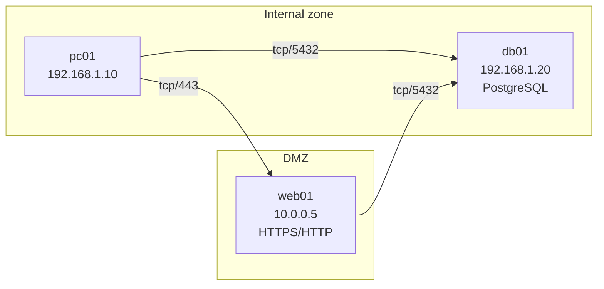

# Example: Client + server + DMZ (Phase 2 multi-host)

Scenario: Three-tier home lab — `pc01` (internal) → `web01` (DMZ) → `db01` (internal).

## Layout



## Command

```bash
fw-audit all-in-one examples/dmz-lab/imports \
  --hosts examples/dmz-lab/hosts.yaml \
  -o out-dmz/ --platform all
```

## Analyze output (sample)

```
Classification summary:
  preferred: 1
  risky: 2
  unsafe: 1

Findings (3):
  [medium] RISKY_PORT_UNAPPROVED: Risky port tcp/5432 ...
  [critical] UNSAFE_PORT_LISTENING: Unsafe service tcp/135 ...
  [high] RISKY_PORT_PUBLIC_BIND: Risky port tcp/80 bound to all interfaces
```

## Session flows (Graphviz DOT excerpt)

```dot
"H001" -> "H002" [label="tcp/443\nhttps", color="#2e7d32"];
"H001" -> "H003" [label="tcp/5432\nport-5432", color="#f9a825"];
"H002" -> "H003" [label="tcp/5432\nport-5432", color="#f9a825"];
```

Render: `dot -Tpng out-dmz/network-dataflow.dot -o network-dataflow.png`

## Zone policy (`hosts.yaml`)

```yaml
allowed_zone_pairs:
  - { from: internal, to: dmz }
  - { from: dmz, to: internal }
  - { from: mgmt, to: dmz }
```

Cross-zone sessions not listed here produce `CROSS_ZONE_UNRESTRICTED` findings.

## web01 nftables (excerpt)

```nftables
chain input {
  policy drop;
  ct state established,related accept
  iif lo accept
  tcp dport 443 accept  # https
}
```

Port 80 remains listening in the export but is **risky/public** — finding recommends binding or blocking on Public profile.
